# 📘 AWS Auto Scaling Test Project

This project demonstrates setting up AWS EC2 Auto Scaling using Launch Templates, Target Groups, and an Application Load Balancer (ALB). It includes a dynamic scaling policy and integrates with ALB for load distribution.

---

## 🟨 Step 1: Create Launch Template

- Go to the EC2 Dashboard → Launch Templates
- Click **Create launch template**
- Fill in the required fields:
  - Name: `auto-scale-template`
  - AMI, Instance Type (e.g., `t2.micro`)
  - Key Pair
  - Security Group
- Save the launch template

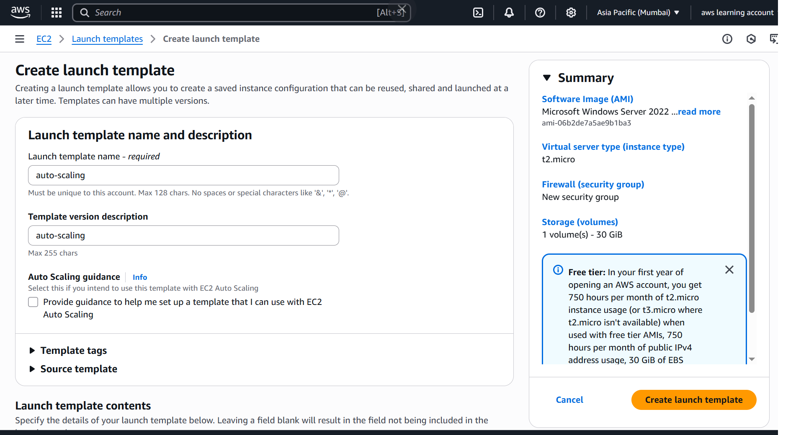
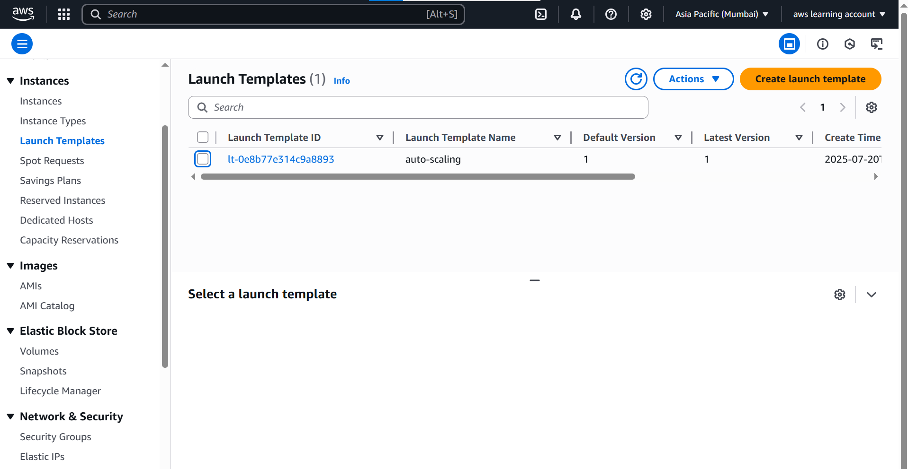

---

## 🟨 Step 2: Create Auto Scaling Group

- Navigate to Auto Scaling Groups → Create
- Select the launch template created above
- Choose:
  - VPC, subnets, and availability zones
  - Minimum: `2`, Desired: `2`, Maximum: `5`
- Configure other necessary settings

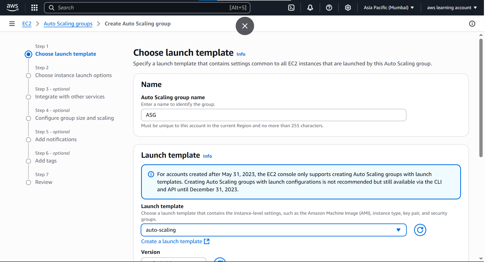  
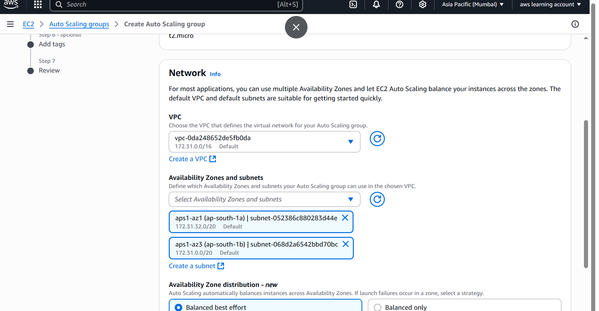
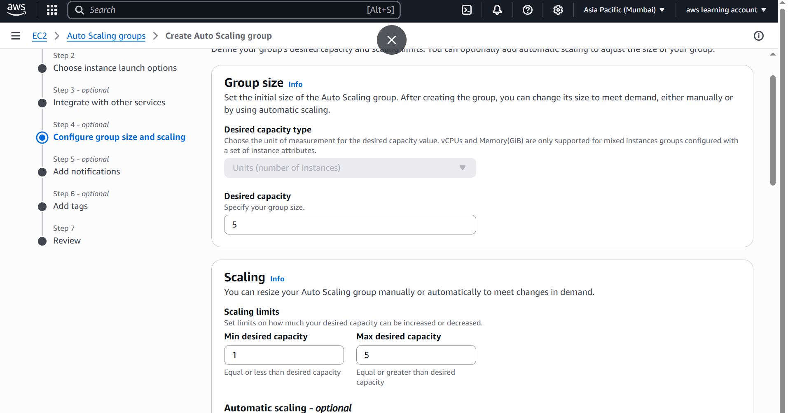
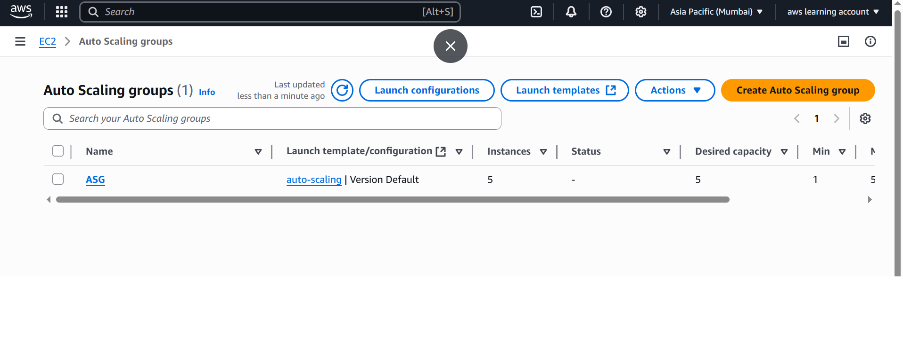

---

## 🟨 Step 3: Create Target Group

- Go to EC2 → Target Groups → Create target group
- Set:
  - Target Type: `Instance`
  - Protocol: `HTTP`, Port: `80`
- Don't register instances (ASG will handle it)

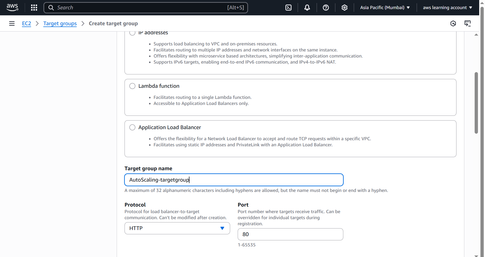

---

## 🟨 Step 4: Create Application Load Balancer (ALB)

- Go to Load Balancers → Create → Choose **Application Load Balancer**
- Configure:
  - Name, Scheme, IP type
  - Select the same VPC, subnets as your ASG
  - Attach previously created Target Group

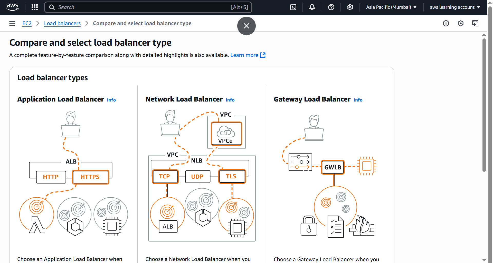  
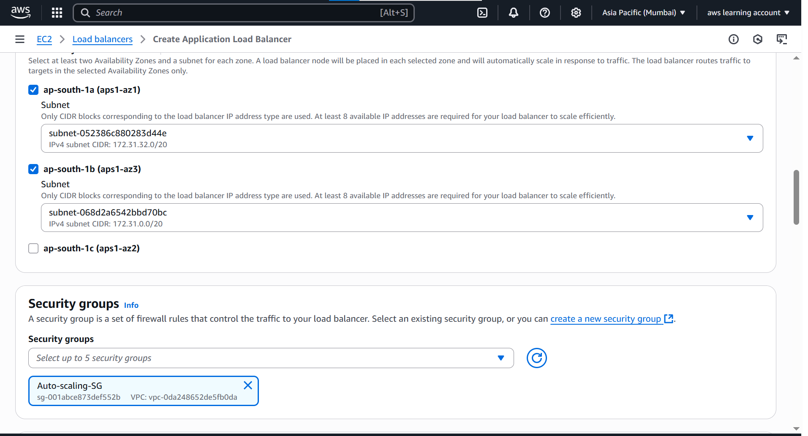  
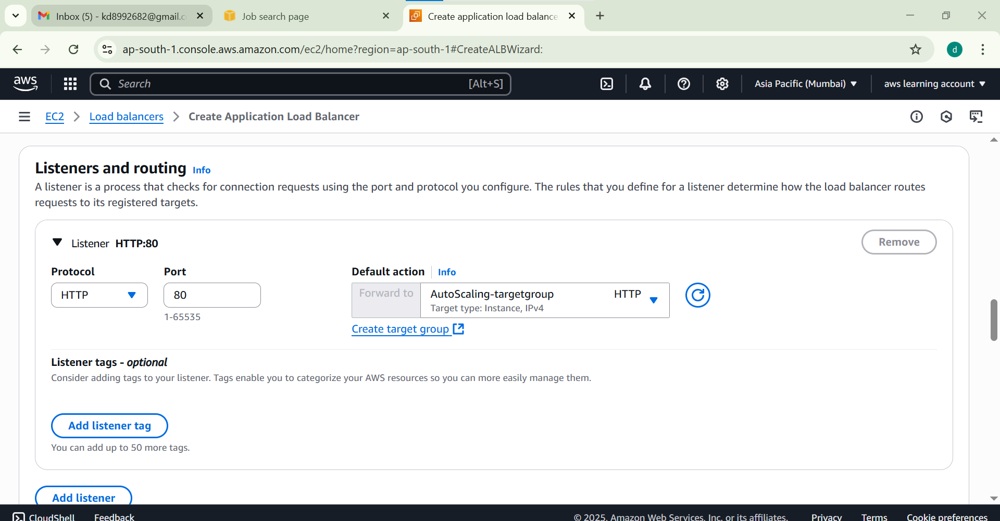

---

## 🟨 Step 5: Attach Load Balancer to ASG

- Go to your Auto Scaling Group → Edit
- Under **Integrations**:
  - Choose: Attach to existing target group
  - Select the previously created Target Group

.png)

---

## 🟨 Step 6: Create Dynamic Scaling Policy

- Inside Auto Scaling Group → Go to **Automatic Scaling**
- Click **Add policy**:
  - Policy Type: `Target Tracking`
  - Metric: e.g., `CPU Utilization`
  - Example: If CPU > 50% → Add instance, if < 20% → Remove
  - *(Note: You can test with custom threshold values)*

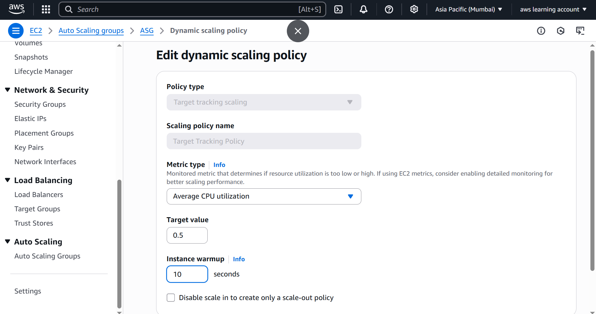

## 💥💻💻 Final output of Auutoscaling

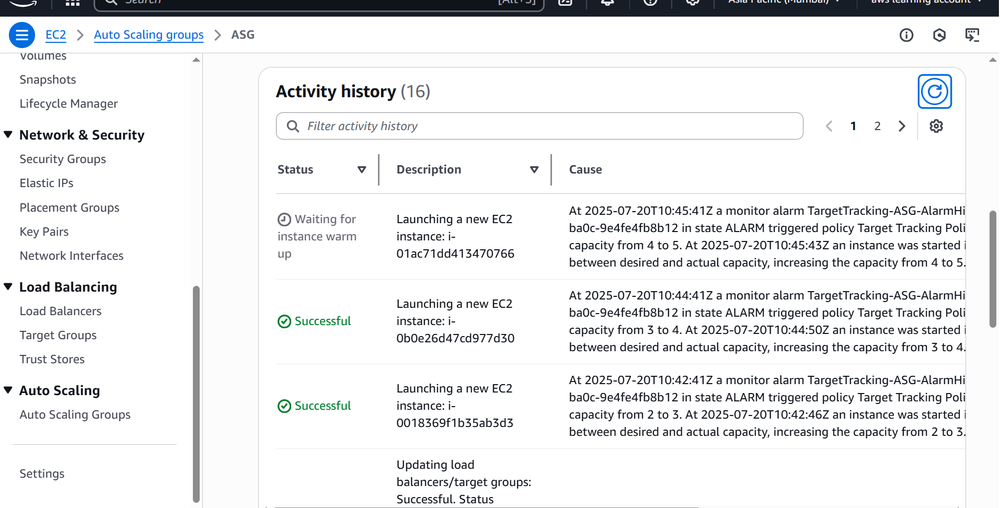

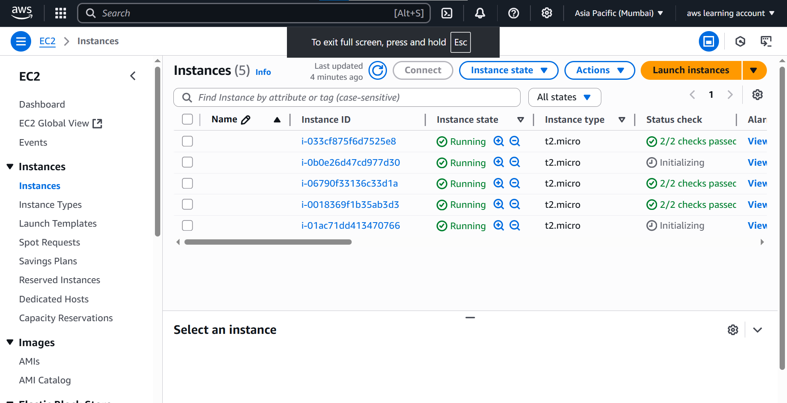

---

## ✅ Final Output

- EC2 Instances auto-scale up to max capacity (5) based on load
- When underutilized, instances terminate automatically
- Monitor via **Activity History** under your ASG

---

## 🗂️ Folder Structure (Local)

## Screenshot 

